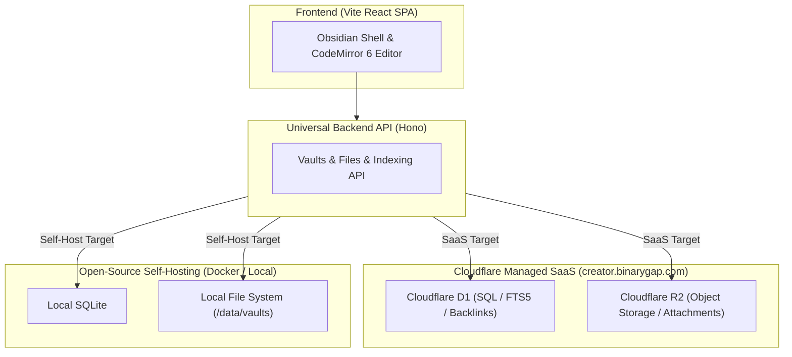

# Creators Desk (`creators-desk`)

> Web-native Obsidian-compatible Markdown PKM & Creative Content Generation Workspace.  
> **Dual Architecture: 100% Open-Source Self-Hosting + Cloudflare-Powered Managed SaaS.**

---

## 1. Overview

**Creators Desk**는 옵시디언(Obsidian)의 "앱보다 파일이 먼저(File over App)" 철학을 계승한 웹 네이티브 마크다운 지식 관리(PKM) 및 크리에이티브 오케스트레이션 플랫폼입니다.

단순한 텍스트 편집기를 넘어, 방대한 세계관 설정(Lore)과 다각화된 제작 파이프라인(소설, 시나리오, 게임 기획, 기술 블로그)을 단일 인터페이스에서 직관적으로 집필·색인·생성할 수 있는 최적의 환경을 제공합니다.

---

## 2. Dual Distribution Model (오픈소스 & 유료 SaaS)

Creators Desk는 **Ghost, Supabase, AppFlowy**와 동일한 **Open-Core / Dual-Target** 아키텍처를 채택합니다.



| 구분 | 오픈소스 셀프호스팅 (Community) | 유료 관리형 SaaS (`creator.binarygap.com`) |
|---|---|---|
| **라이선스 & 비용** | 완전 무료 오픈소스 (Apache-2.0 / MIT) | 월/연 구독형 관리 서비스 |
| **타깃 사용자** | 개발자, 자체 NAS/서버/라즈베리파이 사용자 | 작가, 기획자, 즉시 사용을 원하는 크리에이터 |
| **스토리지** | 로컬 디스크 디렉토리 + SQLite | **Cloudflare R2 (파일)** + **D1 (메타데이터/FTS5)** |
| **배포 방식** | `docker compose up` 단일 컨테이너 (~30MB RAM) | 가입 즉시 글로벌 엣지(Edge) 무설정 사용 |
| **핵심 가치** | 완전한 데이터 소유권과 프라이버시 | **실시간 무설정 클라우드 동기화, 영구 백업, AI 크레딧** |

---

## 3. Key Architectural Pillars

### ① Immutable Key + Mutable Display Alias
- 모든 Vault는 R2/파일 스토리지의 고유 경로가 되는 **불변 고유 키(`vault_key`)**를 부여받습니다.
- 사용자가 에디터에서 볼트 이름을 변경할 때 R2 객체들을 대량 복사(O(N))하지 않고, 데이터베이스의 **`alias` 필드만 O(1)로 즉시 갱신**합니다.

### ② Vite + Hono (No Next.js Hydration Overhead)
- CodeMirror 6와 리치 데스크톱 인터랙션에 최적화된 **Vite React SPA** 클라이언트.
- 웹 표준(`Request`/`Response`) 기반의 초경량 **Hono** API를 사용하여 Cloudflare Pages Functions와 Docker/Node 런타임 양쪽에서 100% 동일한 백엔드 코드를 실행합니다.

### ③ 3단계 하이브리드 색인 (Hybrid Indexing)
1. **위키링크 & 백링크 (`[[Note]]`, `#tag`)**: D1 관계형 테이블로 초고속 참조 그래프 추적.
2. **전문 검색 (Full-Text Search)**: SQLite 내장 FTS5 엔진 기반 본문 검색.
3. **AI 시맨틱 색인 (Vectorize & RAG)**: 집필된 노트를 기반으로 AI가 맥락을 파악하고 글을 이어쓰는 지식 생성 엔진.

---

## 4. Quick Start

### 로컬 개발 환경 실행

```bash
# 레포지토리 클론
git clone https://github.com/Sunggu/creators-desk.git
cd creators-desk

# 의존성 설치
pnpm install # or npm install

# 개발 서버 실행
pnpm dev

# 단위 테스트 실행 (Vitest)
pnpm test

# 프로덕션 빌드
pnpm build
```

---

## 5. License

Apache-2.0 / MIT Dual License.
