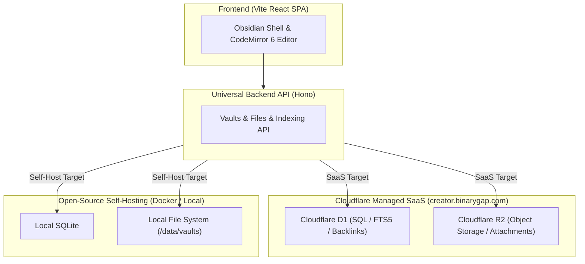

# Creators Desk (`creators-desk`)

> Web-native Obsidian-compatible Markdown PKM & Creative Content Generation Workspace.  
> **Dual Architecture: 100% Open-Source Self-Hosting + Cloudflare-Powered Managed SaaS.**

---

## 1. Overview

**Creators Desk**는 옵시디언(Obsidian)의 "앱보다 파일이 먼저(File over App)" 철학을 계승한 웹 네이티브 마크다운 지식 관리(PKM) 및 크리에이티브 오케스트레이션 플랫폼입니다.

단순한 텍스트 편집기를 넘어, 방대한 세계관 설정(Lore)과 다각화된 제작 파이프라인(소설, 시나리오, 게임 기획, 기술 블로그)을 단일 인터페이스에서 직관적으로 집필·색인·생성할 수 있는 최적의 환경을 제공합니다.

---

## 2. Dual Distribution Model (오픈소스 & 유료 SaaS)

Creators Desk는 **Ghost, Supabase, AppFlowy**와 동일한 **Open-Core / Dual-Target** 아키텍처를 채택합니다.



| 구분 | 오픈소스 셀프호스팅 (Community) | 유료 관리형 SaaS (`creator.binarygap.com`) |
|---|---|---|
| **라이선스 & 비용** | 완전 무료 오픈소스 (AGPL-3.0) | 월/연 구독형 관리 서비스 |
| **타깃 사용자** | 개발자, 자체 NAS/서버/라즈베리파이 사용자 | 작가, 기획자, 즉시 사용을 원하는 크리에이터 |
| **스토리지** | 로컬 디스크 디렉토리 + SQLite | **Cloudflare R2 (파일)** + **D1 (메타데이터/FTS5)** |
| **배포 방식** | `docker compose up` 단일 컨테이너 (~30MB RAM) | 가입 즉시 글로벌 엣지(Edge) 무설정 사용 |
| **핵심 가치** | 완전한 데이터 소유권과 프라이버시 | **실시간 무설정 클라우드 동기화, 영구 백업, AI 크레딧** |

---

## 3. Key Architectural Pillars

### ① Immutable Key + Mutable Display Alias
- 모든 Vault는 R2/파일 스토리지의 고유 경로가 되는 **불변 고유 키(`vault_key`)**를 부여받습니다.
- 사용자가 에디터에서 볼트 이름을 변경할 때 R2 객체들을 대량 복사(O(N))하지 않고, 데이터베이스의 **`alias` 필드만 O(1)로 즉시 갱신**합니다.

### ② Vite + Hono (No Next.js Hydration Overhead)
- CodeMirror 6와 리치 데스크톱 인터랙션에 최적화된 **Vite React SPA** 클라이언트.
- 웹 표준(`Request`/`Response`) 기반의 초경량 **Hono** API를 사용하여 Cloudflare Pages Functions와 Docker/Node 런타임 양쪽에서 100% 동일한 백엔드 코드를 실행합니다.

### ③ 3단계 하이브리드 색인 (Hybrid Indexing)
1. **위키링크 & 백링크 (`[[Note]]`, `#tag`)**: D1 관계형 테이블로 초고속 참조 그래프 추적.
2. **전문 검색 (Full-Text Search)**: SQLite 내장 FTS5 엔진 기반 본문 검색.
3. **AI 시맨틱 색인 (Vectorize & RAG)**: 집필된 노트를 기반으로 AI가 맥락을 파악하고 글을 이어쓰는 지식 생성 엔진.

---

## 4. Getting Started & Setup

### 4.1 Cloudflare 인프라 자동 설치 (1-Command Setup)

Creators Desk는 복잡한 수동 웹 콘솔 작업 없이, **단 하나의 명령어로 Cloudflare D1(DB), R2(스토리지), FTS5 색인 스키마를 자동 프로비저닝**합니다.

#### ① 계정 확인 및 로그인
현재 로컬 머신에 연결된 Cloudflare 계정을 확인합니다:
```bash
npx wrangler whoami
```
> 다른 계정으로 연결하거나 새로 로그인하려면: `npx wrangler login`

#### ② 원클릭 자동 인프라 구축
다음 명령어를 실행하면 스크립트가 모든 인프라를 자동으로 생성하고 연결합니다:
```bash
pnpm run setup
# or npm run setup
```

**자동 실행 내역:**
1. **Cloudflare D1 생성**: `creators-desk-db` 서버리스 SQLite 데이터베이스 자동 생성
2. **스키마 마이그레이션**: `d1/schema.sql` 원격(Remote) 및 로컬(Local) 자동 반영 (Vaults, Files, Links, FTS5)
3. **Cloudflare R2 생성**: `creators-desk-vaults` 오브젝트 스토리지 버킷 자동 생성
4. **설정 동기화**: 발급된 `database_id`를 `wrangler.toml` 파일에 자동 매핑

---

### 4.2 로컬 개발 환경 실행

```bash
# 1. 의존성 설치
pnpm install

# 2. 로컬 개발 서버 실행
pnpm dev

# 3. 단위 테스트 실행 (Vitest)
pnpm test

# 4. 프로덕션 빌드 (고지서 최신 상태 자동 검증 포함)
pnpm build

# 5. 의존성을 추가/삭제한 뒤에는 오픈소스 고지서를 재생성
pnpm run notices
```

---

### 4.3 오픈소스 셀프호스팅 (Docker)

자체 서버나 NAS, 로컬 머신에서 외부 클라우드 의존성 없이 독립적으로 실행할 때 사용합니다:

```bash
# Docker Compose 단일 컨테이너 실행 (~30MB RAM)
docker compose up -d
```
- 데이터는 `./data/vaults` (로컬 파일 시스템) 및 `./data/sqlite.db`에 안전하게 영구 저장됩니다.

---

## 5. License / 고지

본 저장소는 **AGPL-3.0** 로 라이선스됩니다. 전문은 [`LICENSE`](./LICENSE) 에 있습니다.

AGPL-3.0 은 네트워크를 통해 제공되는 프로그램에도 소스 코드 공개 의무를 부과합니다.
앱 안의 **오픈소스 고지** 탭과 배포물에 포함된 고지서 모두에 원본 소스 코드 경로가 명시되어 있습니다.

### 5.1 오픈소스 고지서 (Open Source Notice)

| 산출물 | 위치 | 제공 형태 |
|---|---|---|
| 고지 페이지 | `public/notice.html` → 배포 후 `/notice.html` | 웹 페이지 (검색·목록·라이선스 전문·인쇄 지원) |
| 평문 고지서 | `THIRD-PARTY-NOTICES.txt` | 컨테이너 이미지 및 저장소에 동봉 |
| 앱 내 진입점 | 하단 상태바의 `오픈소스 고지` 링크, 환경설정(`📜 오픈소스 고지`) | 앱 내 이동 |

고지 대상은 **브라우저·서버 번들과 프로덕션 이미지(`node_modules`)에 함께 배포되는 패키지**로,
빌드 도구(Vite, TypeScript, ESLint 등)는 포함하지 않습니다.
단, 배포물 CSS 에 코드가 반영되는 Tailwind CSS 는 별도 절로 구분해 기재합니다.

### 5.2 고지서 갱신

고지서는 수동으로 관리하지 않고 자동 생성됩니다.

```bash
pnpm run notices         # notices/catalog.json + node_modules 트리 -> 고지서 2종 생성
pnpm run notices:check   # 최신 상태만 검증 (빌드 시 자동 실행)
```

- 버전·저장소 URL·저작권 문구는 설치된 `node_modules` 의 `package.json` 과 `LICENSE` 원문에서 추출합니다.
- `notices/catalog.json` 은 자동 수집되지 않는 메타데이터(한국어 설명, 그룹, 고지 범위)만 기재합니다.
- `pnpm test` 와 `pnpm run build` 가 생성물의 최신 상태를 검증하므로, 라이브러리를 추가하고
  고지서를 갱신하지 않으면 빌드가 실패합니다.

